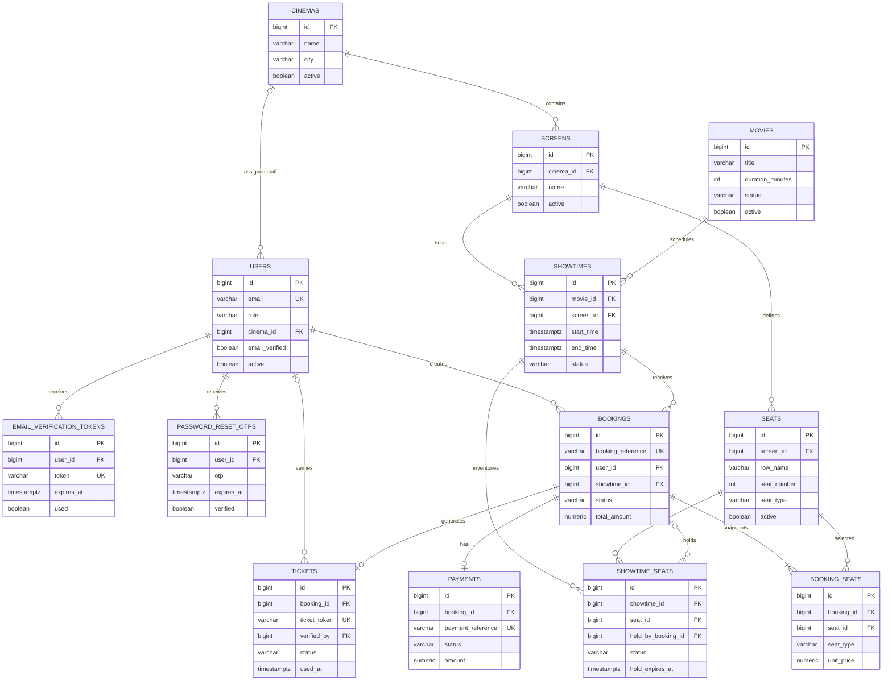

# QuickSeat Database ER Diagram

The database has 13 Flyway-managed tables. Timestamps are stored in PostgreSQL `TIMESTAMPTZ` in UTC.

## Important constraints

- `users.email` is unique.
- `screens(cinema_id, name)` and `seats(screen_id, row_name, seat_number)` are unique.
- `showtime_seats(showtime_id, seat_id)` is unique.
- `bookings.booking_reference`, `payments.payment_reference`, and `tickets.ticket_token` are unique.
- A booking has at most one payment and one ticket; `booking_seats(booking_id, seat_id)` is unique.
- STAFF users require `cinema_id`; CUSTOMER and ADMIN users must not have one.
